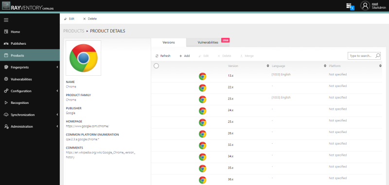

# RayVentory Catalog
###  The software catalog with added value
In RayVentory Catalog, inventoried raw data is assigned to applications using AI-powered software recognition and then presented in prepared reports.

## Getting Started
These instructions will cover usage information and for the docker container 

### Prerequisities
In order to run this container you'll need docker installed.

* [Windows](https://docs.docker.com/windows/started)
* [OS X](https://docs.docker.com/mac/started/)
* [Linux](https://docs.docker.com/linux/started/)

On Windows, make sure to use Linux Containers, WSL2 is recommended. 

### Usage
The default configuration consists of two containers:
* A database powered by mongoDB
* A container with frontend and backend for the catalog

The default configuration is standalone and should work out-of-the-box.

#### Installation with docker-compose
The easiest way to run the image with reasonable default is to use `docker-compose` command.

 1. Get the [`docker-compose.yml`](docker-compose.yml) file from this repository
 2. Login to Raynet container registry with credentials provided by Raynet
 3. In the folder containing the downloaded definition, run the following command: `docker-compose up -d`. 
 3. Login to [`http://localhost:8080`](http://localhost:8080) and use the following credentials:
- Login: `root`
- Password: `root`
 5. Provide the valid license for the product.
 6. After log-in, change your root password and create application users.

 ##### The image #####
RayVentory Catalog is available on docker hub:
[`https://hub.docker.com/r/raynetgmbh/rayventory-catalog`](https://hub.docker.com/r/raynetgmbh/rayventory-catalog)

You can use tags `12.3` (recommended) or `stable` to get the last 12.3 or the last stable version respectively.

#### Environment Variables
Catalog-related:
* `BASEURL` - The base URL which will be used to access the app.
* `MongoConnectionString` - The connection string for mongo database (by default set to the mongoDB created by `docker-compose`)
* `MongoDatabaseName` - The name of the mongoDB database
* `MongoUserName` - The user name used when connecting to the mongoDB
* `MongoPassword` - The password used when connecting to the mongoDB

Database related:
* `MONGO_INITDB_ROOT_USERNAME` - The user name for mongo database
* `MONGO_INITDB_ROOT_PASSWORD` - The password for mongo database
* `MONGO_INITDB_DATABASE` - The database name for mongo database
* `MONGODB_ROOT_PASSWORD` - The root password for mongo database

#### Volumes

* `db_data` - mongoDB data
* `db_config` - mongoDB config

## Find Us

* [Raynet GmbH corporate website](https://raynet.de)
* [Raynet EALM GitHub](https://github.com/raynetEALM)
